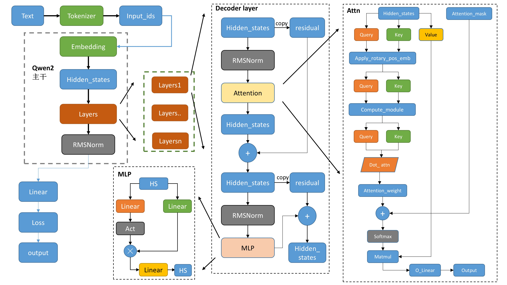

# Qwen整体介绍

Qwen的整体架构与Llama2类似，如下图所示:
  

其中:   
- `tokenizer`将文本转为词表里面的数值。
- 数值经过`embedding`得到一一对应的向量。
- `attention_mask`是用来看见左边、右边，双向等等来设定。
- 各类下游任务，`Casual`,`seqcls`等，基本都是基础模型`model`后面接对应的`Linear`层，还有损失函数不一样。
