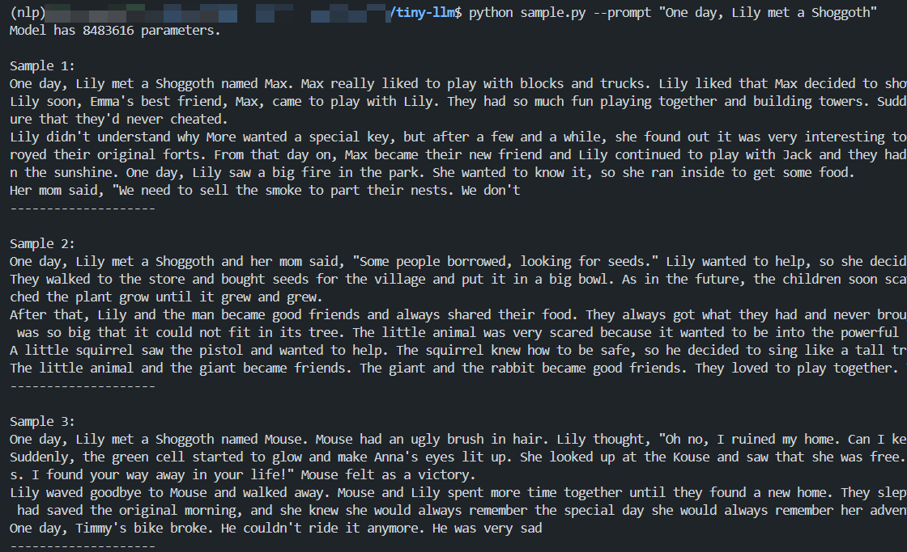

# Tiny-LLM

以下为项目效果展示。

<div align="center">
    
</div>

## 使用教程

```bash
pip install -r requirements.txt
```

然后按照以下步骤进行训练即可：

1. 训练Tokenizer： `python train_vocab.py --download True --vocab_size 4096`
2. 数据预处理：`python preprocess.py`
3. 训练模型：`python train.py`
4. 使用模型生成文本：`python sample.py --prompt "One day, Lily met a Shoggoth"`

#### 当然如果你想使用较原仓库额外的KV Cache来推理的话

在第四步骤中使用`python sample.py --isUseKVCache True--prompt "One day, Lily met a Shoggoth" `，KV Cache默认为False
