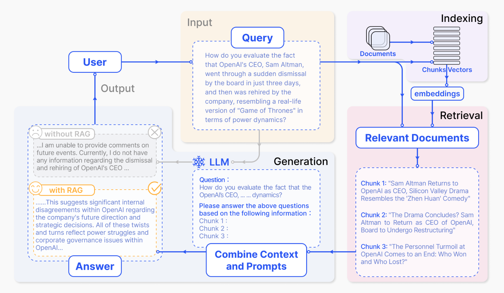

# TinyRAG

## RAG 介绍

LLM会产生误导性的 “幻觉”，依赖的信息可能过时，处理特定知识时效率不高，缺乏专业领域的深度洞察，同时在推理能力上也有所欠缺。

RAG 通过在语言模型生成答案之前，先从广泛的文档数据库中检索相关信息，然后利用这些信息来引导生成过程，极大地提升了内容的准确性和相关性。RAG 有效地缓解了幻觉问题，提高了知识更新的速度，并增强了内容生成的可追溯性，使得大型语言模型在实际应用中变得更加实用和可信。

RAG的基本结构：

- 要有一个向量化模块，用来将文档片段向量化。
- 要有一个文档加载和切分的模块，用来加载文档并切分成文档片段。
- 要有一个数据库来存放文档片段和对应的向量表示。
- 要有一个检索模块，用来根据 Query （问题）检索相关的文档片段。
- 要有一个大模型模块，用来根据检索出来的文档回答用户的问题。

上述这些也就是 TinyRAG 仓库的所有模块内容。

RAG 的流程：

- **索引**：将文档库分割成较短的 Chunk，并通过编码器构建向量索引。
- **检索**：根据问题和 chunks 的相似度检索相关文档片段。
- **生成**：以检索到的上下文为条件，生成问题的回答。

